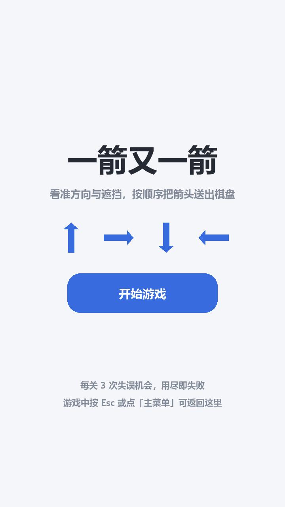
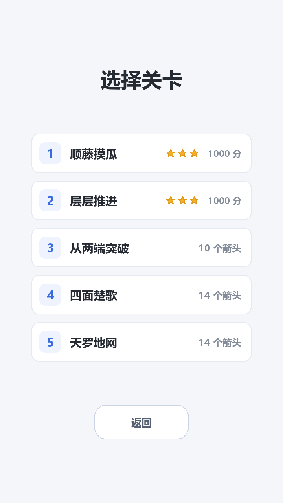
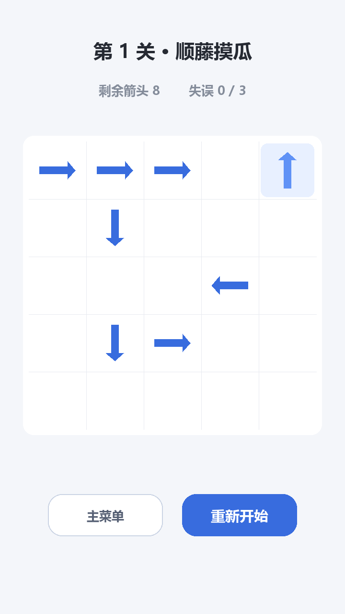
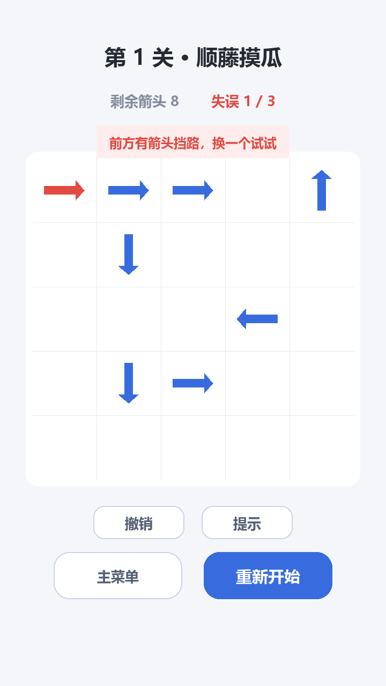

# 一箭又一箭

一款用 Python + Pygame 实现的点击式箭头解谜小游戏。

棋盘中散布着朝上、下、左、右四个方向的箭头。点击某个箭头后，程序检查它前进方向上是否还有别的箭头：没有阻挡就飞出棋盘并被消除，有阻挡则不能消除、并给出碰撞反馈。清空全部箭头即可通关，失误次数用尽则本关失败。

> 本项目为福州大学软件工程课程第二次个人作业。玩法参考微信小游戏《一箭又一箭》的核心规则，未使用原游戏的代码、素材或关卡。

---

## 游戏截图

| 开始界面 | 关卡选择 | 游戏界面 |
|---|---|---|
|  |  |  |

| 碰撞反馈 | 通关 | 失败 |
|---|---|---|
|  |  |  |

以上截图均由 `tools/capture_screenshots.py` 驱动真实游戏代码渲染生成，非手工绘制。

---

## 游戏规则

1. 棋盘为 5×5 网格，格子里是朝上 `↑`、下 `↓`、左 `←`、右 `→` 的箭头，空位不显示。
2. 点击一个箭头，程序沿它的朝向逐格检查到棋盘边界：
   - **前方没有任何箭头** → 箭头飞出棋盘并消失；
   - **前方存在箭头** → 箭头不能消除，闪烁变红并左右晃动，失误次数减 1。
3. 失误次数用尽（默认 3 次）→ 本关失败。
4. 清空本关全部箭头 → 通关，可进入下一关。
5. 随时可以「重新开始」把本关恢复到初始状态。

### 阻挡判定示例

```
→  ·  ·  ↑  ·
```
第一个箭头朝右，但右侧还有箭头，因此**不能**飞出。

```
↑  ·  ·  ·  →
```
最后一个箭头朝右，右侧已到边界，因此**可以**飞出。

判定只考虑同一行或同一列上的箭头，斜向的箭头互不影响。

---

## 开发环境

| 项 | 版本 |
|---|---|
| 操作系统 | Windows 10 / 11 |
| Python | 3.13（3.9 及以上应均可运行） |
| Pygame | 2.6.1 |
| 界面尺寸 | 720 × 1280（手机竖屏 9:16 比例） |

---

## 安装与运行

### 方式一：一键启动（推荐）

1. 用 Git 克隆或直接下载本仓库：

   ```bash
   git clone https://github.com/popochus/one-arrow-after-another.git
   cd one-arrow-after-another
   ```

2. 创建虚拟环境并安装依赖：

   ```bash
   python -m venv .venv
   .venv\Scripts\python.exe -m pip install -r requirements.txt
   ```

3. **双击项目根目录的 `run_game.bat`** 即可开始游戏。

启动脚本会自动使用项目内的虚拟环境，并检查依赖是否就绪；若环境缺失会给出明确提示。

### 方式二：命令行

```bash
python -m venv .venv
.venv\Scripts\python.exe -m pip install -r requirements.txt
.venv\Scripts\python.exe main.py
```

> 启动时终端会打印 `pygame 2.6.1 ...` 和 `Hello from the pygame community` 两行信息，
> 这是 Pygame 的固定提示，不是报错。

---

## 游戏操作说明

| 操作 | 效果 |
|---|---|
| 鼠标点击箭头 | 尝试消除；前方无阻挡则飞出，有阻挡则触发碰撞反馈并扣 1 次失误 |
| 鼠标点击按钮 | 「开始游戏」/「继续游戏」/ 关卡卡片 /「主菜单」/「重新开始」/「下一关」/「重试本关」 |
| `Enter` 或 `空格` | 在开始界面进入选关界面；在结算界面确认主操作 |
| `R` | 重新开始当前关卡 |
| `Esc` | 游戏中或结算界面 → 返回开始界面；在开始界面再按一次退出程序 |

界面底部始终并排显示两个按钮：左侧「主菜单」（返回开始界面），右侧为当前场景的主操作。

---

## 功能一览

- **四方向箭头与路径检测**：沿朝向逐格扫描，边界与阻挡判定统一处理
- **两类动画反馈**：飞出（0.40 秒飞出并淡出）、碰撞（0.34 秒晃动，幅度 9 像素 + 变红 + 顶部文字提示）
- **失误机制**：每关 3 次机会，界面实时显示剩余次数
- **四套界面**：开始界面、关卡选择界面、游戏界面、通关/失败结算界面
- **5 个关卡**：难度递进，全部经求解器验证可通关
- **继续游戏**：通关过至少一关后，开始界面出现「继续游戏 · 第 N 关」入口
- **关卡选择**：可直接进入任意一关，已通关的关卡标绿色「已通关」

界面顶部的信息栏实时显示：当前关卡名、剩余箭头数、剩余失误次数。

---

## 关卡设计

| 关卡 | 主题 | 箭头数 | 设计意图 |
|---|---|---|---|
| 第 1 关 | 顺藤摸瓜 | 8 | 教学关，出口明显，用于理解基本规则 |
| 第 2 关 | 层层推进 | 10 | 引入纵向依赖：需先清掉下方的箭头才能放走上方的 |
| 第 3 关 | 从两端突破 | 10 | 上下两排须从两端向中间逐个清理，考验顺序感 |
| 第 4 关 | 四面楚歌 | 14 | 可飞出的位置分散在棋盘四周 |
| 第 5 关 | 天罗地网 | 14 | 首轮仅少数箭头可飞出，依赖链最长 |

关卡以「字符画」形式定义（见 `game/levels.py`），设计时能一眼看出箭头间的阻挡关系：

```python
"""
>  >  >  .  ^
.  v  .  .  .
.  .  .  <  .
.  v  >  .  .
.  .  .  .  .
"""
```

### 关卡可解性如何保证

「关卡实际上无法通关」是本项目重点规避的问题。做法有两条：

1. **理论依据**：本游戏的规则决定了「能否飞出」是一个**单调**性质——消除箭头只会减少障碍，不会制造新的障碍。因此只要每次都点掉当前可飞出的箭头，若最终能清空则关卡可解，若中途无箭头可飞则说明存在死锁。据此贪心循环即可完成判定。
2. **工具验证**：`tools/verify_levels.py` 对全部关卡逐一求解并输出完整通关顺序；
   `tools/gen_levels.py` 则用「反向放置」法构造候选布局——从最后被消除的箭头开始倒着放置，
   放置时要求它到边界之间没有已放置的箭头，这样生成的布局必然对应一条合法通关顺序。

当前 5 个关卡均已通过校验，每关都能给出明确的通关顺序。

---

## 项目结构

```
main.py                    程序入口
game/
  config.py                窗口尺寸、网格布局、配色、动画参数、中文字体
  board.py                 箭头数据模型与路径检测（核心逻辑）
  levels.py                关卡数据（字符画描述）
  solver.py                求解器：判定关卡可解性
  renderer.py              全部界面绘制
  app.py                   主流程、界面状态机、事件处理、动画推进
tools/
  verify_levels.py         关卡可通关性校验
  gen_levels.py            可解关卡生成器（反向放置法）
  run_tests.py             自动化测试 + Markdown 报告导出
  capture_screenshots.py   截图生成
docs/
  screenshots/             界面截图
  test_report.md           自动化测试报告
run_game.bat               一键启动
run_tests.bat              一键运行测试
DEVLOG.md                  开发过程记录（含 AIGC 协作过程）
```

---

## 测试

项目包含一套自动化测试，采用 SDL 的 dummy 视频驱动，无需弹出窗口即可完整运行。

```bash
# 方式一：双击 run_tests.bat
# 方式二：命令行
.venv\Scripts\python.exe tools\run_tests.py
```

测试覆盖两层：**逻辑层**直接调用 `Board.can_fly_out()` 验证路径判断；**交互层**调用 `Game.on_click()` 模拟真实鼠标点击，连同动画状态与失误计数一起验证。

测试项目包括作业要求的 T01 ~ T06，以及路径检测边界情况（1×1 棋盘、贴边朝外、阻挡不在同一行列等）和界面流程（返回主菜单、关卡选择、继续游戏）。

运行结束后会自动生成 Markdown 格式的报告：`docs/test_report.md`。

---

## 开发说明

本项目在开发过程中借助 AIGC 编程工具辅助完成，主要用于需求拆解、代码结构设计、路径检测实现、关卡生成与测试用例编写。所有 AI 生成的代码均经实际运行验证，多轮出现的问题（包括错误的边界处理与测试用例本身的缺陷）均已定位并修正。

完整的协作过程记录见 [DEVLOG.md](DEVLOG.md)，其中逐条写明每次提出的要求、AI 提供的方案、实际效果以及人工修改的内容。

### 素材来源

项目所有图形均由 Pygame 代码实时绘制，音效未使用，**不包含任何第三方美术素材或音频文件**。
