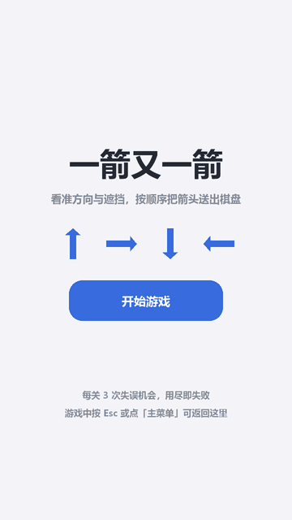

# 软件工程第二次个人作业 ——「一箭又一箭」小游戏

| 项目 | 内容 |
| --- | --- |
| 这个作业属于哪个课程 | [202601 软件工程班级博客](https://edu.cnblogs.com/campus/fzu/202601SofwareEngineering) |
| 这个作业要求在哪里 | [第二次个人作业](https://edu.cnblogs.com/campus/fzu/202601SofwareEngineering/homework/16717) |
| 这个作业的目标 | 使用 Python 和 AIGC 完成"一箭又一箭"小游戏 |
| 学号 | 162404103 |
| GitHub 仓库 | <https://github.com/popochus/one-arrow-after-another> |

---

## 一、项目展示

**玩法演示**（本人实际操作录制）：



**界面截图**：

| 开始界面 | 游戏过程 | 通关结算 | 失败结算 |
| --- | --- | --- | --- |
|  |  |  |  |

---

## 二、项目介绍

### 2.1 游戏规则

棋盘上散布着朝上、下、左、右四个方向的箭头。点击一个箭头时，程序检查它朝向的那条线上、到棋盘边界之间还有没有别的箭头：

- **前方没有阻挡**：箭头沿朝向滑出棋盘并消失；
- **前方有箭头阻挡**：箭头原地变红晃动，失误次数 +1。

清空本关全部箭头即通关；失误次数（每关 3 次）耗尽则本关失败。

```
→  ·  ·  ↑  ·        朝右的箭头右边还有箭头，不能飞出
·  ·  ·  ·  →        朝右的箭头右边到边界空无一物，可以飞出
```

### 2.2 界面设计

界面按手机竖屏比例设计，共五个画面：开始、选关、游戏、通关结算、失败结算。游戏画面顶部显示关卡名、剩余箭头、用时和失误次数，中部是棋盘，底部是「撤销 / 提示」与「主菜单 / 重新开始」；选关画面列出五张关卡卡片，已通关的显示星级与得分，五关都可直接进入。

### 2.3 主要功能

基础玩法之外，还实现了这些：

- **关卡生成器与求解器**：生成器反向放置构造必然可解的布局，求解器负责校验关卡；
- **撤销 / 提示**：撤销把棋盘与失误次数一起退回上一步，提示高亮一个确实能飞出的箭头，另配快捷键 `U` / `H`；
- **计时与星级评价**：每关独立计时，判定即停表；星级由失误 + 提示次数决定，0 次三星、1 次两星、2 次及以上一星；
- **得分**：满分 1000，每次失误 −200，超出参考时长后每秒 −10，保底 200；
- **四声音效**：飞出 / 碰撞 / 撤销 / 通关，波形由代码合成，不引入音频文件；
- **自动化测试**：用例覆盖核心逻辑，一条命令跑完并生成 Markdown 报告。

所有图形均由程序绘制，没有使用任何商业游戏素材；关卡的可解性由求解器逐一校验，测试与截图也都由脚本生成。

---

## 三、实现思路

### 3.1 箭头与方向的表示

一个箭头就是**一个格子加一个方向**，用不可变的数据类表示：

```python
@dataclass(frozen=True)
class Arrow:
    row: int
    col: int
    direction: str      # 'up' / 'down' / 'left' / 'right'
```

方向不存成角度或向量，而是存成字符串，再通过一张映射表换算成行列增量：

```python
DIRECTIONS = {
    "up": (-1, 0),
    "down": (1, 0),
    "left": (0, -1),
    "right": (0, 1),
}
```

这样做的好处是：**方向本身可读**，调试和测试输出时直接打印 `'up'`；所有涉及坐标运算的地方都统一查 `DIRECTIONS`。

棋盘内部用字典以 `(row, col)` 为键存箭头，键就是坐标，取某个格子的箭头是 O(1)，消除时直接删键即可。同时保留一份初始布局副本，供「重新开始」复原。

### 3.2 关卡如何表示

关卡用**字符画**描述，一个字符代表一个格子：

```python
_RAW_LEVELS = [
    (
        "第 1 关 · 顺藤摸瓜",
        """
        >  >  >  .  ^
        .  v  .  .  .
        .  .  .  <  .
        .  v  >  .  .
        .  .  .  .  .
        """,
    ),
    # ...
]
```

`^` 向上、`v` 向下、`<` 向左、`>` 向右、`.` 空位。

五个关卡的设计意图如下：

| 关卡 | 主题 | 箭头数 | 设计意图 |
| --- | --- | --- | --- |
| 1 | 顺藤摸瓜 | 8 | 教学关，出口明显 |
| 2 | 层层推进 | 10 | 引入纵向依赖（先清下面才能放走上面） |
| 3 | 从两端突破 | 10 | 上下两排必须从两端往中间逐个清，考顺序感 |
| 4 | 四面楚歌 | 14 | 可飞位置分散在四周 |
| 5 | 天罗地网 | 14 | 首轮只有少数箭头能飞，依赖链最长 |

### 3.3 路径检测

```python
def can_fly_out(self, arrow):
    """判断箭头能否飞出棋盘。"""
    d_row, d_col = DIRECTIONS[arrow.direction]
    row = arrow.row + d_row          # 从箭头的"下一格"开始
    col = arrow.col + d_col

    while self.is_inside(row, col):  # 还在棋盘内
        if (row, col) in self._arrows:
            return False             # 撞到箭头 -> 被阻挡
        row += d_row
        col += d_col

    return True                      # 一路走到棋盘外 -> 畅通
```

思路是**从箭头沿朝向逐格往前走**：中途只要碰到任何箭头就判定被阻挡，一路走出棋盘则判定畅通。

其中把越界判断单独抽成 `is_inside()`，作为循环条件：

```python
def is_inside(self, row, col):
    return 0 <= row < self.rows and 0 <= col < self.cols
```

如果不这样写，四个方向就要各写一遍边界判断，四份代码里只要有一处把 `<` 写成 `<=`，就会出现**数组越界或误判贴边箭头**。收敛到一处之后，边界只有一种写法，测试也只需要覆盖一遍。

边界情况由 9 项用例覆盖：1×1 的棋盘上四个方向都应能直接飞出，贴边朝外的箭头不应报错。

## 四、AIGC 使用过程

本次开发全程使用 **WorkBuddy** 作为 AIGC / Coding Agent 工具，从需求拆解、代码编写到问题排查都有参与。
下面选择几次代表性协作过程。

| 子任务 | 借助何种 AIGC 技术 | AI 实现或提供了什么 | 效果如何 | 人工修改 |
| --- | --- | --- | --- | --- |
| 路径检测 | WorkBuddy | 提供 `can_fly_out()`：沿朝向逐格前进判断阻挡与出界，越界判断抽成 `is_inside()` | 1×1 棋盘、贴边朝外均不越界 | 代码一字未改。我只卡了范围：只做同行同列、不加斜向，并要求补 9 项边界用例后才用 |
| 关卡设计与可解性 | WorkBuddy | 没给坐标，而是给了可解性推论（消除只减少障碍，贪心即可判定死锁）和「反向放置」构造法 | 5 关全部可解；生成器 4000 个布局经求解器复验全部通过 | 定了关卡设置的难度 |
| 修复"按 `R` 没反应" | WorkBuddy | 没先改代码，而是写脚本复现，确认代码没坏；真因是输入法接管键盘，入口调 `stop_text_input()` | 按 `R` 恢复正常，补 2 项用例全过 | 报了“按 R 没效果”这个现象、没猜原因，否则很可能把本来正确的代码改坏 |
| 修复"按得快就不结算" | WorkBuddy | 查到"判定 → 结算"之间的动画延迟里没锁输入，误点会重置倒计时；还发现失败后点光箭头会被改写成胜利 | 新增用例通过；反向验证时删掉那道锁，用例立刻失败 | 问题由我试玩发现，报给 ai 解决问题 |

---

## 五、测试结果

运行方式（项目根目录）：

```
python tools/run_tests.py
```

### 测试

| 编号 | 测试内容 | 预期结果 | 实际结果 | 是否通过 |
| --- | --- | --- | --- | --- |
| T01 | 点击前方无阻挡的箭头 | 箭头飞出棋盘并消失 | 剩余 8 → 7，失误 0 | 通过 |
| T02 | 点击前方有阻挡的箭头 | 箭头不消失，失误次数减 1 | 剩余 8 → 8，失误 1 | 通过 |
| T03 | 点击位于边缘且朝向棋盘外的箭头 | 箭头正常消失，不发生越界错误 | 剩余 8 → 6，越界异常=False | 通过 |
| T04 | 消除本关全部箭头 | 显示通关并进入下一关 | 本关清空=True，点按钮进入第 2 关=True | 通过 |
| T05 | 失误次数耗尽 | 显示失败并允许重新开始 | 耗尽后结果=lose，重开恢复正常=True | 通过 |
| T06 | 游戏进行中重新开始 | 箭头布局和失误次数恢复 | 剩余 8/8，失误 0 | 通过 |

运行输出：

```
$ python tools/run_tests.py
==============================================================================
一箭又一箭 · 自动化测试报告
==============================================================================
[PASS] T01      点击前方无阻挡的箭头
         预期：箭头飞出棋盘并消失
         实际：剩余 8 → 7，失误 0
[PASS] T02      点击前方有阻挡的箭头
         预期：箭头不消失，失误次数减 1
         实际：剩余 8 → 8，失误 1
[PASS] T03      点击位于边缘且朝向棋盘外的箭头
         预期：箭头正常消失，不发生越界错误
         实际：剩余 8 → 6，越界异常=False
……
------------------------------------------------------------------------------
合计 34 项，通过 34 项，失败 0 项
Markdown 报告已写入：docs\test_report.md
```

---

## 六、PSP 表格

| 任务 | 预估耗时（小时） | 实际耗时（小时） | 差异（小时） |
| --- | --- | --- | --- |
| 需求分析与游戏设计 | 1.0 | 0.8 | -0.2 |
| Python 与图形库学习 | 1.5 | 0.5 | -1.0 |
| 游戏界面实现 | 3.0 | 2.0 | -1.0 |
| 路径与碰撞逻辑实现 | 2.0 | 1.0 | -1.0 |
| 关卡设计 | 2.0 | 1.0 | -1.0 |
| AIGC 辅助开发 | 2.5 | 1.5 | -1.0 |
| 测试与修改 | 2.0 | 1.5 | -0.5 |
| README 与博客撰写 | 1.5 | 2.0 | 0.5 |
| **合计** | **15.5** | **10.3** | **-5.2** |

---

## 七、心得体会

本次作业里 AIGC 帮我把界面绘制、路径判断、四个音效和测试脚本很快做了出来。它给我的是一个能跑的起点，剩下的判断还得我自己做。

几次最关键的修改都不是读代码读出来的，是我自己玩的时候发现的。窗口比屏幕高，Windows 会把窗口整体上移，标题栏和顶部文字一起被裁掉，得改成按屏幕可用高度等比缩放；胜负判定之后没有锁住输入，连点会让结算界面永远弹不出来，失败之后接着点还能把输的翻成赢；重新开始本关R按了没用；音效第一版刺耳。这几件事只能靠在真实游玩才能发现。

我按贪心算法叫ai先做关卡校验，五关写完跑一遍确认可解才留下；后来写生成器也是反向放的，从一个必然能清空的终点往前推，4000 个布局经求解器复验全部可解。测试脚本也是ai帮忙搭的框架，34 项用例，改完代码跑一条命令就能复跑。回头看，工具确实省了敲代码的时间，但哪些逻辑是对的、哪些关卡真的能通关、哪些界面看着舒服，还是要我自己运行、观察和判断，能不能看出它什么时候在胡说八道。

---
